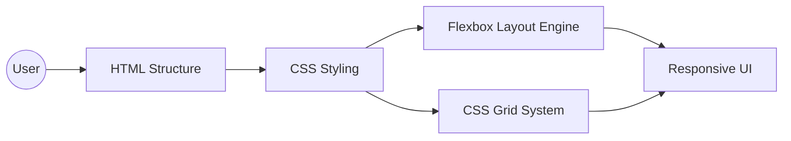

# Suntech Assignments - Week 6: Intermediate CSS Layout Engines & Responsive Design

Welcome to the documentation for the **Week 6 Frontend Assignments**.  
This week focuses entirely on mastering modern **CSS Layout Systems**, responsive web design principles, and adaptive UI development using:

- HTML5
- CSS3
- Flexbox
- CSS Grid
- Media Queries

The primary goal of this week's assignments is to build clean, responsive, and visually structured interfaces before moving into frontend frameworks and utility-first CSS libraries.

---

# 📂 Week 6 Project Folder Structure

The repository is organized into multiple standalone assignments demonstrating different layout systems and responsive design techniques.

```text
frontend-demos-mernstack/
└── Week6/
    ├── Assignment1/
    │   ├── index.html      # Advanced forms & input handling
    │   └── style.css       # Interactive form styling
    │
    ├── Assignment2/
    │   ├── index.html      # Flexbox layout systems
    │   └── style.css       # Flex alignment & spacing
    │
    ├── Assignment3/
    │   ├── index.html      # CSS Grid dashboard layout
    │   └── style.css       # Grid positioning & structure
    │
    ├── Assignment4/
    │   ├── index.html      # Responsive web layouts
    │   └── style.css       # Media query breakpoints
    │
    └── Assignment5/
        ├── index.html      # Capstone landing page UI
        └── style.css       # Combined Flexbox/Grid responsive styling
```

---

# 🛠️ Technologies Used

The projects are developed using:

- HTML5
- CSS3
- Flexbox
- CSS Grid
- Media Queries
- Responsive Design Principles

---

# ⚙️ Frontend Layout Architecture



---

# 📦 Assignment Breakdown

---

# 1️⃣ Assignment 1 - Advanced Forms & Input Styling

Focuses on building structured web forms with interactive states and validation-based styling.

---

## Features

- Input fields
- Labels & placeholders
- Form grouping
- Validation styling
- Interactive pseudo classes

---

## CSS Selectors Used

```css
:focus
:hover
:valid
:invalid
```

---

## Concepts Covered

- Form accessibility
- Input styling
- User interaction feedback
- Form layout structuring

---

# 2️⃣ Assignment 2 - Flexbox Layout Engine

Introduces modern one-dimensional layout systems using Flexbox.

---

## Features

- Navigation bars
- Card layouts
- Horizontal & vertical alignment
- Flexible content distribution

---

## Flexbox Properties Used

```css
display: flex;
justify-content: center;
align-items: center;
flex-direction: row;
gap: 20px;
```

---

## Concepts Covered

- Main axis & cross axis
- Flex alignment
- Dynamic spacing
- Responsive content flow

---

# 3️⃣ Assignment 3 - CSS Grid Layout System

Focuses on two-dimensional layout structures using CSS Grid.

---

## Features

- Dashboard layouts
- Grid item placement
- Column & row spans
- Gap management

---

## Grid Properties Used

```css
display: grid;
grid-template-columns;
grid-template-rows;
gap;
```

---

## Concepts Covered

- Two-dimensional layouts
- Grid positioning
- Layout balancing
- Responsive grid systems

---

# 4️⃣ Assignment 4 - Responsive Design & Media Queries

Demonstrates mobile-first responsive web design principles.

---

## Features

- Adaptive layouts
- Mobile responsiveness
- Breakpoint handling
- Flexible containers

---

## Media Query Example

```css
@media screen and (max-width: 768px) {
    .container {
        flex-direction: column;
    }
}
```

---

## Concepts Covered

- Mobile-first design
- Responsive breakpoints
- Flexible UI adaptation
- Screen-size optimization

---

# 5️⃣ Assignment 5 - Capstone Landing Page UI

Combines all concepts into a complete responsive landing page interface.

---

## Features

- Multi-section landing page
- Hero section
- Navigation system
- Responsive cards
- Combined Flexbox & Grid layouts
- UI transitions

---

## Concepts Covered

- Component structuring
- Full-page responsive design
- Modern UI layouts
- Layout composition techniques

---

# 🌐 CodePen Assignment Links

Codepen links --->
https://codepen.io/ANANYA-PAGIDIMARRI-the-flexboxer/pen/MYeMzpN
https://codepen.io/ANANYA-PAGIDIMARRI-the-flexboxer/pen/azZgQqm 
https://codepen.io/ANANYA-PAGIDIMARRI-the-flexboxer/pen/qENzQym 
https://codepen.io/ANANYA-PAGIDIMARRI-the-flexboxer/pen/JoKQemN 
https://codepen.io/ANANYA-PAGIDIMARRI-the-flexboxer/pen/wBWLEPB 
https://codepen.io/ANANYA-PAGIDIMARRI-the-flexboxer/pen/vEKqzKV

#  How to Run the Projects

---

# Step 1: Clone Repository

```bash
git clone https://github.com/ananya-pagidimarri/frontend-demos-mernstack.git
```

---

# Step 2: Open Project Folder

```bash
cd frontend-demos-mernstack
```

---

# Step 3: Open HTML Files

Open any `index.html` file directly in your browser.

---

# Step 4: Run Using Live Server (Recommended)

1. Open project in VS Code
2. Install Live Server Extension
3. Right-click `index.html`
4. Click:

```text
Open with Live Server
```

---

#  Frontend Workflow

```text
1. User Opens Webpage
        ↓
2. HTML Loads Structure
        ↓
3. CSS Applies Styling
        ↓
4. Flexbox/Grid Organizes Layout
        ↓
5. Media Queries Trigger
        ↓
6. Responsive UI Adapts to Device
```

---

# 🧠 Concepts Covered

These assignments demonstrate:

- Semantic HTML5
- CSS Styling Systems
- CSS Selectors
- Flexbox Layout Engine
- CSS Grid System
- Responsive Design
- Media Queries
- Mobile-First Design
- UI Layout Structuring
- Component Styling
- Modern Frontend Design Principles


